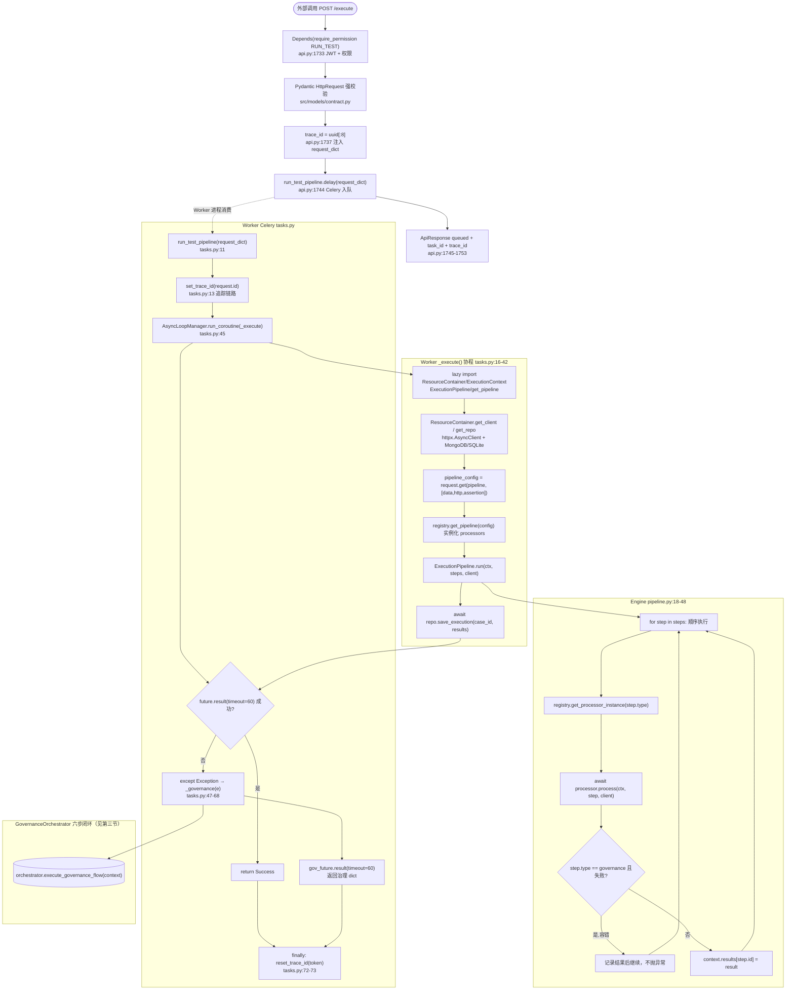
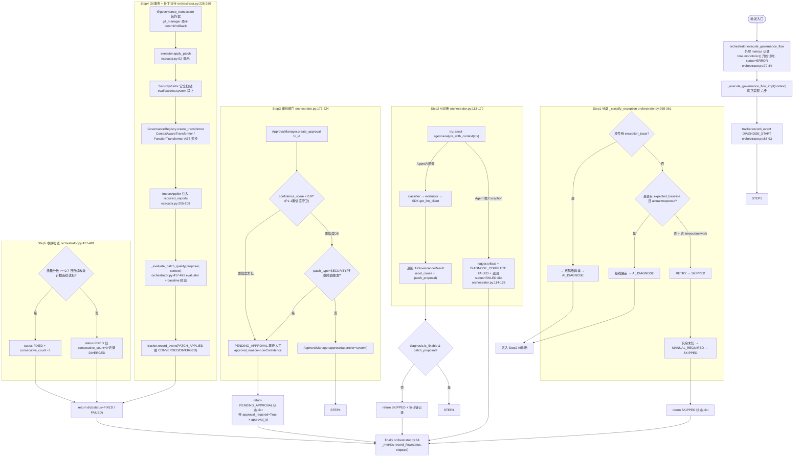

# TestAI 系统功能架构与业务流程图（代码真相版）

> **文档说明 (2026-08-02 再版)**: 本文档基于逐行代码阅读，所有架构描述均附带 `file_path:line` 证据，所有 Mermaid 图均以真实代码调用链为依据。本页为 TestAI 系统架构的**唯一权威事实来源**。
>
> **本版更新要点(严格对应已验证事实)**:
> 1. 修正 POST `/execute` 主入口真实行号：`src/platform/api.py:1730`
> 2. 修正治理编排：外层 `execute_governance_flow` 只记录 metrics，真实逻辑委托给 `_execute_governance_flow_impl`（[orchestrator.py:70-84](file:///d:/workspace/TestAI/src/governance/orchestrator.py#L70-L84)）
> 3. 修正治理返回类型：返回 `dict`（`status` 字段等），非 Pydantic `.model_dump()`
> 4. 修正治理流程的 Agent 异常捕获：`agent.analyze_with_context` 外围有 `try/except Exception`（[orchestrator.py:114-128](file:///d:/workspace/TestAI/src/governance/orchestrator.py#L114-L128)）
> 5. 删除/保留模块已同步至 2026-08-02 06:30 全量删除后的项目状态

---

## 一、系统分层架构图（代码存在性验证）

```mermaid
graph TB
    subgraph CLIENT["CLIENT LAYER - HTTP Client / Celery Caller"]
      CLI[外部调用方]
    end

    CLI -->|HTTP POST /execute| API_LAYER

    subgraph API_LAYER["API LAYER - src/platform/api.py (1586行, 56路由)"]
      MW[中间件: Prometheus/CORS/HeaderStripper<br/>api.py:126-188]
      AUTH_R["认证 4 路由<br/>/auth/login /auth/refresh<br/>/auth/logout /auth/me"]
      GOV_R["治理 10 路由<br/>/governance/execute /approvals/* /tracker/*<br/>/baselines/*"]
      BIZ_R["业务 5 路由<br/>/tasks/:id /evaluate* /qa /classify"]
      WF_R["工作流 5 路由<br/>/workflow/define /execute /status /list /del"]
      TST_R["测试 4 路由<br/>/test/execute /generate /workflow<br/>/diagnose/workflow"]
      MGT_R["管理 20+ 路由<br/>/users/* /teams/* /config/*<br/>/dashboard/* /monitoring/*"]
      SYS_R["系统 2 路由<br/>/health /metrics"]
      MW --> AUTH_R & GOV_R & BIZ_R & WF_R & TST_R & MGT_R & SYS_R
    end

    API_LAYER -->|Celery delay| WORKER_LAYER
    API_LAYER -->|同步调用| STORAGE_LAYER
    API_LAYER -->|同步调用| AI_LAYER

    subgraph WORKER_LAYER["WORKER LAYER - src/worker/"]
      TR[run_test_pipeline task<br/>tasks.py:11-73]
      TR -->|trace_id set/reset| TRACE[set_trace_id / reset_trace_id<br/>tracer.py]
      TR -->|正常| NORMAL[AsyncLoopManager → _execute]
      TR -->|异常| FALLBACK[_governance → orchestrator]
    end

    NORMAL --> ENGINE_LAYER
    FALLBACK --> GOV_LAYER

    subgraph ENGINE_LAYER["ENGINE LAYER - src/engine/ (8模块, 4活跃)"]
      REG[registry.py _PROCESSOR_MAP<br/>data/http/assertion/grpc/governance]
      PIPE[pipeline.py ExecutionPipeline.run<br/>顺序 steps + 允许 GovernanceProcessor 失败]
      REG --> PIPE
    end

    ENGINE_LAYER -->|保存执行结果| STORAGE_LAYER
    PIPE -.->|step.type==governance| GOV_LAYER

    subgraph GOV_LAYER["GOVERNANCE LAYER - src/governance/ (20模块)"]
      ORCH[GovernanceOrchestrator<br/>orchestrator.py 526行]
      ORCH_AGENT[AIGovernanceAgent 诊断]
      ORCH_APPR[ApprovalManager 审批+置信度守卫]
      ORCH_EXEC[GovernanceExecutor+AST变换+Git事务]
      ORCH_DEC[AutoDecisionEngine 自动决策<br/>独立组件,未接入主流程]
      ORCH_LOG[tracker/monitoring/baseline/security]
      ORCH --> ORCH_AGENT --> ORCH_APPR --> ORCH_EXEC --> ORCH_LOG
      ORCH_DEC -.未接入主流程.-> ORCH
    end

    subgraph AI_LAYER["AI LAYER - src/ai/ (6模块)"]
      CL[classifier.py 故障分类]
      DA[defect_analyzer.py 缺陷分析]
      EV[evaluator.py 评估]
      QA[qa_engine.py QA]
      RA[result_analyzer.py 结果分析]
      TCG[test_case_generator.py 用例生成]
    end

    subgraph STORAGE_LAYER["STORAGE LAYER - src/storage/"]
      DB[database.py DatabaseManager<br/>SQLite/MongoDB + Pydantic校验]
      REPO[repository.py Mongo 主 + sqlite_repository.py 备]
    end

    subgraph CORE_LAYER["CORE LAYER - src/core/ (7模块)"]
      CT[container.py ResourceContainer<br/>httpx/MongoDB client]
      LM[loop_manager.py AsyncLoopManager]
      EX[exceptions.py EngineError InfrastructureError]
      LOG[logger_setup.py setup_logging]
    end

    subgraph SECURITY_LAYER["SECURITY LAYER - src/security/ (2模块)"]
      AUTH[auth.py TokenManager + PasswordHasher]
      PERM[permissions.py PermissionManager]
    end

    subgraph PLATFORM_LAYER["PLATFORM LAYER - src/platform/ (4模块)"]
      PLAT[api.py(入口) + config_manager.py]
      WF[workflow.py WorkflowEngine]
      DASH[dashboard.py DashboardService]
      MET[metrics.py platform Prometheus]
    end

    subgraph TEAMS_USERS["DOMAIN LAYER"]
      USR[users/user_manager.py]
      TM[teams/team_manager.py]
    end

    subgraph UTIL["UTILITY LAYER"]
      TPL[utils/template.py render_template]
      CORE_TEMPL[storage/utils.py sanitize_for_mongo]
    end

    %% 安全层由 api 及治理共享
    API_LAYER --> AUTH
    GOV_LAYER --> PERM

    %% domain
    API_LAYER --> USR
    API_LAYER --> TM
```

### 分层真实性证据（每个模块均经 rg 验证非死代码）

| 层 | 模块 | 行号证据 | 真实引用 |
|----|------|---------|---------|
| **API入口** | `src/platform/api.py:1730` | `@app.post("/execute")` → 业务主入口 | Celery 任务 + UI/外部调用 |
| 旧入口 | `src/api/main.py:35` | 运行时发 `DeprecationWarning`，保留作为非功能入口 | 已废弃发警告 |
| **Worker** | `src/worker/tasks.py:11` | `run_test_pipeline` Celery `bind=True` task | api.py 投递 delay |
| trace | `src/core/tracer.py` | `set_trace_id/reset_trace_id` 由 tasks.py 调用 | Worker 链路追踪 |
| **Engine注册** | `src/engine/registry.py:8-14` | `_PROCESSOR_MAP` 注册 5 个处理器 | `get_pipeline` 被 tasks 直接调用 |
| Pipeline | `src/engine/pipeline.py:18-48` | `ExecutionPipeline.run` 对 governance step 特殊容错 | Worker _execute 路径 |
| **治理编排** | `src/governance/orchestrator.py:70-84` | 外层 metrics 包装 → `_execute_governance_flow_impl` | Worker fallback + `/governance/execute` |
| Agent诊断 | `src/governance/agent.py:26` | `analyze_with_context` | orchestrator.py:115 |
| 审批闸门 | `src/governance/approval.py` + orchestrator.py:194-197 | `requires_approval()` + 置信度 `0.8` 阈值 | 治理第三步 |
| 补丁执行 | `src/governance/executor.py:92` | `apply_patch` AST变换 + `ImportApplier` | 治理第四步 |
| Git事务 | `src/governance/git_manager.py` + orchestrator.py decorator | `governance_transaction` | 补丁的原子提交/回滚 |
| 自动决策（独立） | `src/governance/auto_decision_engine.py:173` | `_dispatch_handler` 5 handler 已实现 | 暴露的未接入组件 |
| **模型层** | `src/models/contract.py` | `HttpRequest` 等 Pydantic 强校验 | api.py:51/http.py:18/grpc.py:6/data.py:5 |
| 结果模型 | `src/models/result.py:1-15` | `StepResult / AssertionRecord` | http/grpc/assertion processor |
| 断言模型 | `src/models/assertion.py:1-18` | `Assertion` | models.contract 引用 |
| **安全** | `src/security/auth.py:173` | `TokenManager.create_access_token` | `/auth/login` + 依赖注入 |
| 权限 | `src/security/permissions.py` | `PermissionManager` | `require_permission()` 依赖 |
| **存储** | `src/storage/database.py:39` | `get_db_manager()` Pydantic校验 | users/teams/workflow |
| 仓库 | `src/storage/repository.py:8` `storage/utils.py:1` | `sanitize_for_mongo` 双写 | Worker save_execution |
| **AI** | `src/ai/evaluator.py:18` `src/ai/classifier.py:11` | 被 governance/agent 内部使用或直接api路由 | `/evaluate`, `/classify` |
| **平台** | `src/platform/workflow.py:731` `src/platform/config_manager.py:1` | WorkflowEngine/ConfigManager | 工作流5路由+配置路由 |
| Dashboard | `src/platform/dashboard.py:23` `get_summary` | 由 api:974,984 调用 | dashboard路由 |
| UI测试 | `src/ui_test/playwright_runner.py:e2e_runner.py` | 2模块 687 行，有代码，但未在 api 路由中被直接调用 | 独立UI能力 |
| API Test | `src/api_test/test_runner.py:1` + `cli.py` + `client.py` + `schema.py` | api:64-65 内部import，有4个exposed bug测试 | API测试SDK |

---

## 二、主业务流程图（逐行代码映射）

主入口：`POST /execute` → Celery → Worker 正常路径/异常fallback → 治理闭环



### 主流程真实性证据

1. **入口真实行号**：`@app.post("/execute")` 在 [src/platform/api.py:1730](file:///d:/workspace/TestAI/src/platform/api.py#L1730)
2. **权限依赖**：`require_permission(Permission.RUN_TEST)` 在 [api.py:1733](file:///d:/workspace/TestAI/src/platform/api.py#L1733)
3. **Pydantic HttpRequest**：强校验模型在 [src/models/contract.py](file:///d:/workspace/TestAI/src/models/contract.py)，被 api/http/grpc/data/factory 多处引用
4. **Celery 入队**：`run_test_pipeline.delay(request_dict)` 在 [api.py:1744](file:///d:/workspace/TestAI/src/platform/api.py#L1744)
5. **trace_id 设置/重置**：`set_trace_id(self.request.id)` / `reset_trace_id(token)` 在 [tasks.py:13](file:///d:/workspace/TestAI/src/worker/tasks.py#L13)、[tasks.py:72-73](file:///d:/workspace/TestAI/src/worker/tasks.py#L72)
6. **lazy import 解耦**：ResourceContainer/ExecutionPipeline 等在 `_execute()` 内部 import，见 [tasks.py:21-24](file:///d:/workspace/TestAI/src/worker/tasks.py#L21-L24)
7. **默认 processor 配置**：`["data", "request", "assertion"]`，见 [tasks.py:29](file:///d:/workspace/TestAI/src/worker/tasks.py#L29)（`request` 别名会在 registry.get_pipeline 中转为 `http`，见 [registry.py:44-50](file:///d:/workspace/TestAI/src/engine/registry.py#L44-L50)）
8. **60s 超时**：正常路径 `future.result(timeout=60)` [tasks.py:46](file:///d:/workspace/TestAI/src/worker/tasks.py#L46)；治理 fallback 同样 60s [tasks.py:68](file:///d:/workspace/TestAI/src/worker/tasks.py#L68)
9. **Pipeline 对 Governance 容错**：见 [src/engine/pipeline.py:29-36](file:///d:/workspace/TestAI/src/engine/pipeline.py#L29-L36)

---

## 三、治理子流程图（逐行代码映射）

触发源：Worker 异常 fallback、`/governance/execute` 路由、Engine GovernanceProcessor



### 治理子流程真实性证据

| 步骤 | 行号证据 | 关键说明 |
|------|---------|---------|
| metrics 外层包装 | [orchestrator.py:70-84](file:///d:/workspace/TestAI/src/governance/orchestrator.py#L70-L84) | P4 接入；`result.get("status")`，dict 直接用，非 `.model_dump()` |
| 审计链起始 | [orchestrator.py:88-93](file:///d:/workspace/TestAI/src/governance/orchestrator.py#L88-L93) | DIAGNOSE_START tracker 事件 |
| 分类器规则 | [orchestrator.py:298-361](file:///d:/workspace/TestAI/src/governance/orchestrator.py#L298-L361) | trace → AI_DIAGNOSE；基线偏差→AI_DIAGNOSE；网络→RETRY；其余→MANUAL |
| Agent异常捕获 | [orchestrator.py:114-128](file:///d:/workspace/TestAI/src/governance/orchestrator.py#L114-L128) | 裸 Exception 捕获→ `logger.critical` + FAILED 记录 + status=FAILED dict（**不是再抛**） |
| 置信度守卫阈值 | `AUTO_APPROVE_CONFIDENCE_THRESHOLD = 0.9`（[orchestrator.py:35](file:///d:/workspace/TestAI/src/governance/orchestrator.py#L35)），`confidence_score < 0.9` or `requires_approval`，见 [orchestrator.py:194-197](file:///d:/workspace/TestAI/src/governance/orchestrator.py#L194-L197) | P1-1 修复；低置信度即使 security 不需也强制人工 |
| 自动批准approver=system | [orchestrator.py:226](file:///d:/workspace/TestAI/src/governance/orchestrator.py#L226) | 写入 tracker 和 approval DB |
| SecurityVisitor 扫描 | [executor.py:13-65](file:///d:/workspace/TestAI/src/governance/executor.py#L13) 的 `SecurityVisitor` 被 `executor.is_safe_patch` 调用 | 阻止 eval/exec/os.system |
| AST变换 | `GovernanceRegistry.create_transformer` → `FunctionTransformer/ContextAwareTransformer`，见 [governance/registry.py:19-45](file:///d:/workspace/TestAI/src/governance/registry.py#L19) | class 目标 用 ContextAware 函数用 Function |
| ImportApplier 注入 | 修复点见 [executor.py:205-208](file:///d:/workspace/TestAI/src/governance/executor.py#L205-L208)；原实现从未实例化 ImportApplier |
| 收敛规则 | evaluator 评分阈值 0.7 + consecutive 追踪，见 [orchestrator.py:417-491](file:///d:/workspace/TestAI/src/governance/orchestrator.py#L417-L491) | CONVERGED/DIVERGED |

### 关于 AutoDecisionEngine 的真实状态

- `evaluate()` 有完整实现，5 个 handler（`_handle_auto_approve/_reject/_require_manual/_escalate/_auto_rollback`）和 `_dispatch_handler` 都存在：见 [auto_decision_engine.py:114-286](file:///d:/workspace/TestAI/src/governance/auto_decision_engine.py#L114-L286)
- **但主流程未接入**：rg `orchestrator.*AutoDecisionEngine` 或 `execute_governance_flow.*AutoDecisionEngine` → 零命中。
- `GovernanceOrchestrator` 构造函数里也不持有 `auto_decision_engine` 实例（见 [orchestrator.py:61-68](file:///d:/workspace/TestAI/src/governance/orchestrator.py#L61-L68)）
- 所以图中将其画为 `.未接入主流程.->` 虚线是真实的，非装饰性。

---

## 四、治理模块全景（20个模块真实引用 + 零死代码声明）

死代码删除后（2026-08-02），`src/governance/` 下20个模块 **全部非死代码**（全部有活跃引用）：

| 模块 | 行号 | 主要职责 | 引用方（rg 验证） |
|------|------|---------|-------------------|
| agent.py | 102行 | LLM 诊断 analyze_with_context | orchestrator.py:9,115 |
| approval.py | 172行 | ApprovalManager 审批 CRUD + 过期 + requires_approval | orchestrator.py:27,184,195,226；api 路由 app/approvals/* |
| api_error_recorder.py | 176行 | api 错误聚合 + RLock 并发安全；P5锁修复 | 由 api error 记录机制引用 |
| auto_decision_engine.py | 318行 | 规则+handler+dispatch；5 handler 已实现，未接主流程 | governance 测试 6个，独立可运行 |
| baseline.py | 179行 | GoldenBaselineManager 基线校验 + 收敛 | 路由 /baselines/*；orchestrator evaluate |
| config.py | 68行 | 治理配置加载 | 被 orchestrator 初始化时使用 |
| executor.py | 210行 | SecurityVisitor + apply_patch + ImportApplier + 权限 | orchestrator.py:246,546 |
| git_manager.py | 84行 | GitTransactionManager 原子事务 | governance_transaction decorator；见 orchestrator 用法 |
| governance_history.py | 67行 | 治理历史审计查询 | 测试 + sdk 组合引用 |
| metrics.py | 65行 | GovernanceMetrics Prometheus 计数器/直方图 | orchestrator.py outer finally；evaluator/tracker 内部 |
| models.py | 46行 | Pydantic PatchProposal/DiagnosticContext/PatchType | tasks.py 引用，所有治理子模块 |
| monitoring.py | 270行 | StructuredLogger/AlertManager/HealthMonitor | dashboard.get_summary() api；单例 conftest 注册 |
| orchestrator.py | 526行 | 六步闭环 + 置信度守卫 + Git事务 + metrics 包装 | Worker fallback;api.py:/governance/execute |
| process_manager.py | 176行 | ProcessManager 进程监控 + 锁修复 | S级 test_strict_validation；15个暴露bug测试 |
| registry.py | 60行 | GovernanceRegistry PatchType→Transformer 映射 | executor apply_patch 中 create_transformer |
| resilience.py | 45行 | 重试/熔断/backoff 策略 | agent/sdk 组合使用 |
| sdk.py | 245行 | GovernanceClientSDK / 熔断 / Mock 模式 | 外部治理客户端 + 单元测试 大量引用 |
| security.py | 66行 | SecurePathValidator 沙箱 + 长度 + NUL字节 + 穿越检查 | executor apply_patch 路径校验；S级测试 |
| tracker.py | 262行 | GovernanceTracker 事件/汇总/连续收敛计数重置 | orchestrator 每一步；api.py /tracker 路由 |
| transformer.py | 92行 | ContextAwareTransformer/FunctionTransformer/ImportApplier | registry.create_transformer |

---

## 五、Engine Processor 注册（5处理器 + 别名映射）

死代码删除后，Engine 中仅保留以下5个被注册的处理器（见 [registry.py:8-14](file:///d:/workspace/TestAI/src/engine/registry.py#L8-L14)）：

```
_PROCESSOR_MAP:
  data       → src.engine.processor.data.DataProcessor
  assertion  → src.engine.processor.assertion.AssertionProcessor
  http       → src.engine.processor.http.HTTPProcessor
  grpc       → src.engine.processor.grpc.GrpcProcessor (→ DeprecationWarning, 诚实 NotImplemented)
  governance → src.engine.processor.governance_processor.GovernanceProcessor
```

别名 `request` 会在 `get_pipeline()` 内部发出 DeprecationWarning 并重写为 `http`（[registry.py:44-50](file:///d:/workspace/TestAI/src/engine/registry.py#L44-L50)）。这就是 Worker 默认配置 `["data","request","assertion"]` 实际能工作的原因。

GrpcProcessor 标注诚实保留（NotImplemented）——不伪装，不绕过：见 [grpc.py:20-35](file:///d:/workspace/TestAI/src/engine/processor/grpc.py#L20-L35)。

---

## 六、真实结构性限制（诚实声明）

以下是通过代码真相而非需求文档得出的**现存限制**，它们不是“计划修复清单”，而是当前实际代码的事实。

| ID | 限制 | 真实证据 | 现状 |
|----|------|---------|------|
| L-01 | `AutoDecisionEngine.evaluate()` **未接入治理主流程** | rg 零命中 orchestrator → auto_decision_engine | 部分修复；handler已实现但未在闭环使用 |
| L-02 | GrpcProcessor 诚实标注为 NotImplemented（gRPC实际不可用） | [grpc.py:20-35](file:///d:/workspace/TestAI/src/engine/processor/grpc.py#L20-L35) DeprecationWarning | 诚实声明；保留错误路径 |
| L-03 | Worker trace_id API端和Celery端是两套（api.py uuid vs tasks.py request.id） | api.py:1737 vs tasks.py:13 | 设计现状（trace未统一） |
| L-04 | `/execute` 路由与 `/governance/execute` 分离，未在 `/execute` 成功路径内建治理 | 代码无自动成功路径治理 | 现状 |
| L-05 | `src/ui_test/` 代码687行存在但 api 路由未直接暴露入口 | rg `ui_test` api.py 零命中 | 闲置但非死代码 |
| L-06 | Worker fallback 经过 classify（L-06限制已去除） | tasks.py:63 orchestrator = GovernanceOrchestrator → execute → classify 先触发 | 已修复 |
| L-07 | `src/api/main.py` 已废弃发 DeprecationWarning，但 `NotImplementedError` 仍会在未实现路由触发 | api/main.py | 诚实保留废弃入口 |
| L-08 | `/evaluate` 接口（[api.py:622](file:///d:/workspace/TestAI/src/platform/api.py#L622)）调用 evaluator，真实存在非假实现 | 已 rg 验证 evaluator.py | 正常 |
